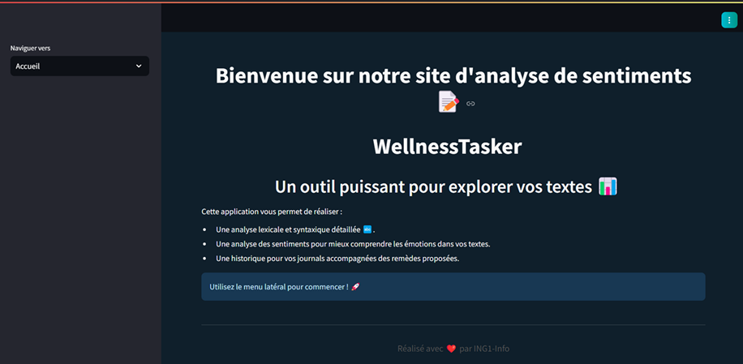

#  Analyseur de Texte en Français – NLP avec Streamlit & OpenAI


Bienvenue dans ce projet de **Traitement Automatique du Langage Naturel (NLP)** utilisant **Python**, **Streamlit**, **spaCy**, **NLTK**, **TextBlob**, et un backend **Node.js** connecté à **OpenAI GPT**.

Ce projet permet d’analyser un texte en français selon trois dimensions :
- 🔤 Analyse **lexicale** : découpage, fréquence, mots-clés
- 🧠 Analyse **syntaxique** : lemmes, POS, dépendances
- 😊 Analyse **émotionnelle** : via **VADER**, **TextBlob** et **GPT-3.5**

---

## 📸 Captures d’écran

### Interface principale :


### Arbre syntaxique :


### Analyse émotionnelle :


---

## 🧰 Technologies utilisées

### Python (Frontend)

| Bibliothèque        | Rôle |
|---------------------|------|
| **Streamlit**       | Interface web rapide et interactive |
| **spaCy**           | Analyse syntaxique (lemmes, POS, dépendances) |
| **NLTK**            | Tokenisation, stopwords, analyse VADER |
| **TextBlob**        | Analyse de sentiment basée sur polarité |
| **Pandas**          | Gestion des tableaux de fréquences |
| **json**            | Stockage historique dans `results.json` |

### JavaScript (Backend)

| Package        | Rôle |
|----------------|------|
| **Express**    | Serveur backend Node.js |
| **OpenAI**     | Connexion à GPT-3.5 pour analyser les sentiments |
| **CORS**       | Autoriser les connexions entre Streamlit et Node |

---

## 📦 Installation (Étape par étape)

# 📦 Installation complète du projet NLP (Frontend + Backend)

# 1. Cloner le dépôt
 ```bash
git clone https://github.com/syrine-ammar/projet-NLP.git
cd projet-NLP.git
``` 


# 2. Installer les bibliothèques Python
 ```bash
pip install -r requirements.txt 
``` 
# ou bien:
```bash
python -m nltk.downloader punkt stopwords vader_lexicon
python -m textblob.download_corpora
python -m spacy download fr_core_news_sm
``` 
# 3. Lancer l'interface Streamlit
```bash
streamlit run acceuil.py                  # Page d'accueil
``` 

# 5. Lancer le backend Node.js (GPT-3.5)
```bash
npm install express openai cors
node serveur.js  # Serveur démarré sur http://localhost:3000
``` 
#  Le projet est maintenant opérationnel !

